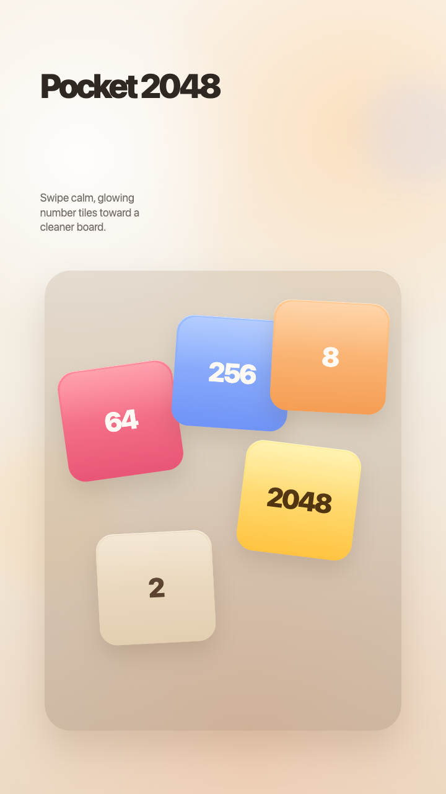
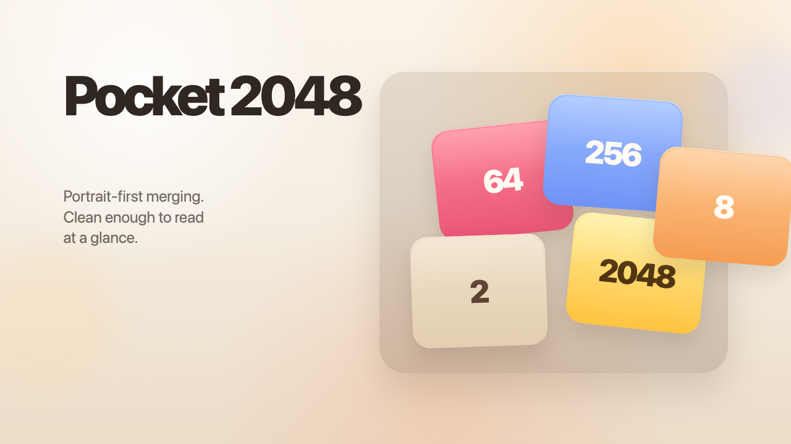

# Pocket 2048

Pocket 2048 is a portrait-first take on the classic swipe-merge puzzle. The game keeps the familiar 4x4 loop, strips the UI down to score and restart, and leans on a calm warm palette instead of loud arcade chrome.

## Play

- PlayDrop listing: https://www.playdrop.ai/creators/autonomoustudio/apps/game/pocket-2048
- Hosted build: https://assets.playdrop.ai/creators/autonomoustudio/apps/pocket-2048/v1.0.0/index.html

## Surfaces

- Best platform: mobile portrait
- Additional supported platform: desktop

## Controls

- Mobile portrait: swipe anywhere on the board
- Desktop: arrow keys or WASD

## Release assets

