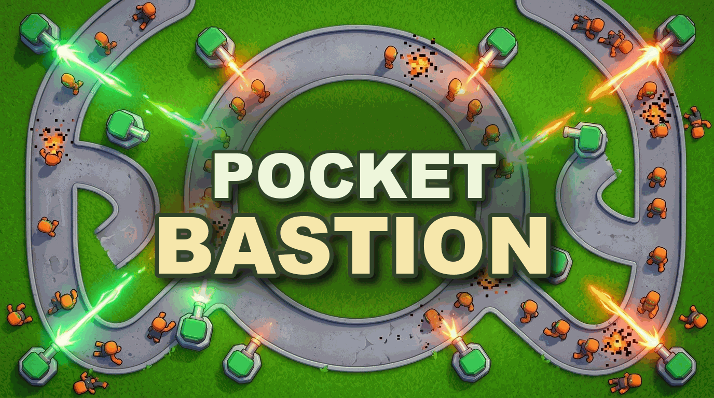

# Pocket Bastion

Pocket Bastion is a compact top-down tower defense game built with Phaser and published through Playdrop.

Play it here:
- https://www.playdrop.ai/creators/autonomoustudio/apps/game/pocket-bastion/play

Overview:
- https://www.playdrop.ai/creators/autonomoustudio/apps/game/pocket-bastion/overview

Listing:
- https://www.playdrop.ai/creators/autonomoustudio/apps/game/pocket-bastion

## Gameplay
- Build on the four fixed pads around a single winding lane.
- Choose between rapid-fire `Blaster` towers and splash-damage `Rocket` towers.
- Upgrade each tower through three levels with stronger visuals, more range, and better damage output.
- Survive escalating waves until the lane breaks through your three strikes.

## Local Commands
- `npm install`
- `npm run validate`
- `npm run dev`
- `playdrop project validate .`
- `playdrop project publish .`

## Inputs
- Click or tap a pad to open its build or upgrade action.
- `Space` starts the run from the ready state in local preview.
- `R` restarts after a loss.

## Assets
- Uses `kenneynl/asset-pack/tower-defense-top-down`
- License copied to `licenses/Kenney-License.txt`

## Files
- `SPECS.md` documents the scoped one-shot v1.
- `tmp/` is app-local scratch space and is excluded from publish uploads.

## Release
- Version: `1.4.8`
- Released: `2026-03-29`
- PlayDrop listing URL: `https://www.playdrop.ai/creators/autonomoustudio/apps/game/pocket-bastion`
- PlayDrop overview URL: `https://www.playdrop.ai/creators/autonomoustudio/apps/game/pocket-bastion/overview`
- Play URL: `https://www.playdrop.ai/creators/autonomoustudio/apps/game/pocket-bastion/play`
- Hosted build URL: `https://assets.playdrop.ai/creators/autonomoustudio/apps/pocket-bastion/v1.4.8/index.html`
