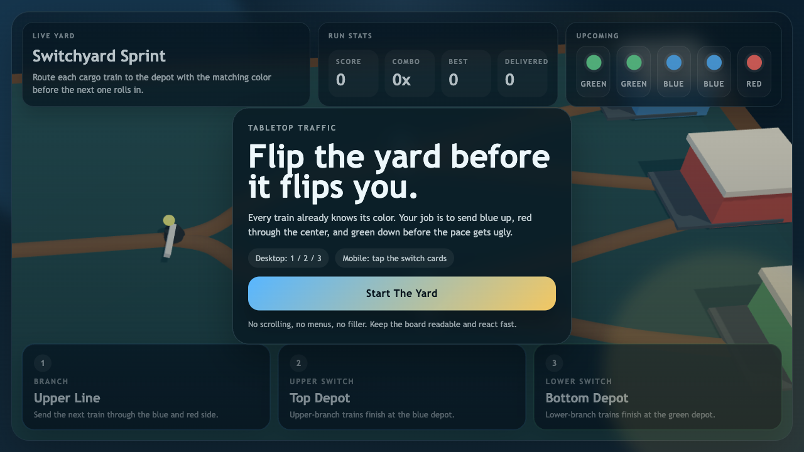
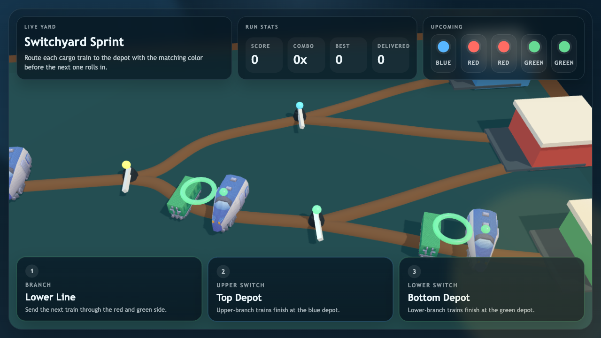
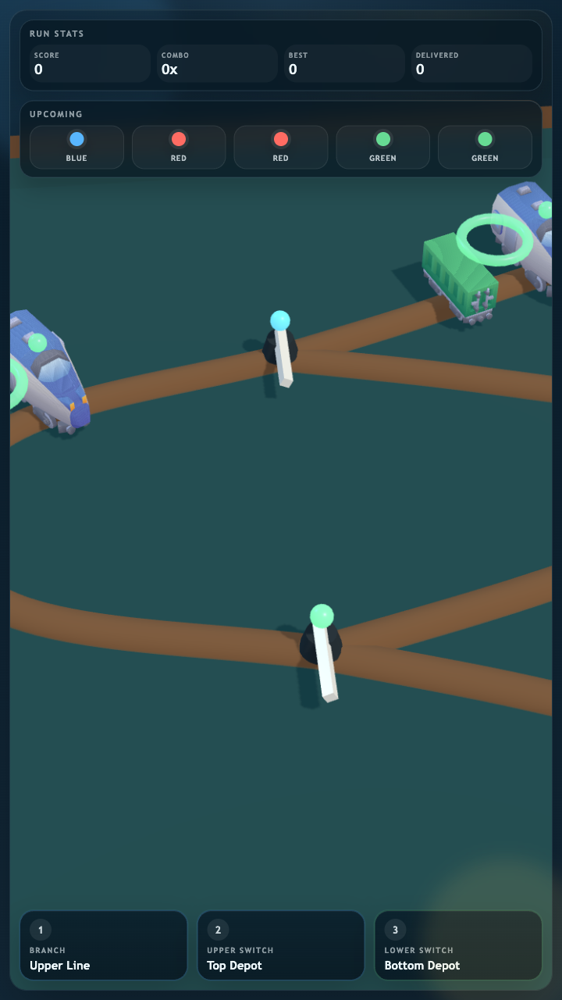

# Switchyard Sprint

Switchyard Sprint is a fast arcade routing game about flipping a tiny rail yard before the schedule collapses.

## Live Links

- Play: https://assets.playdrop.ai/creators/autonomoustudio/apps/switchyard-sprint/v1.0.0/index.html
- Store listing: https://www.playdrop.ai/creators/autonomoustudio/apps/game/switchyard-sprint/overview

## What It Is

Every train already knows its cargo color. Your job is to read the queue, flip three switches in time, and send blue trains up, red trains through the center, and green trains down before a single bad route ends the run.

## Controls

- `1`: toggle the branch switch
- `2`: toggle the upper switch
- `3`: toggle the lower switch
- tap the switch cards on touch devices

## Gallery

## Local Development

- `npm install`
- `npm run dev`
- `playdrop project validate .`
